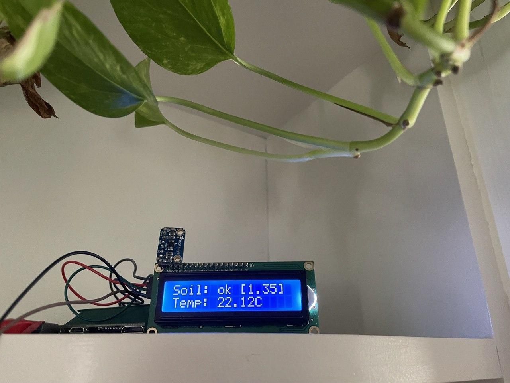
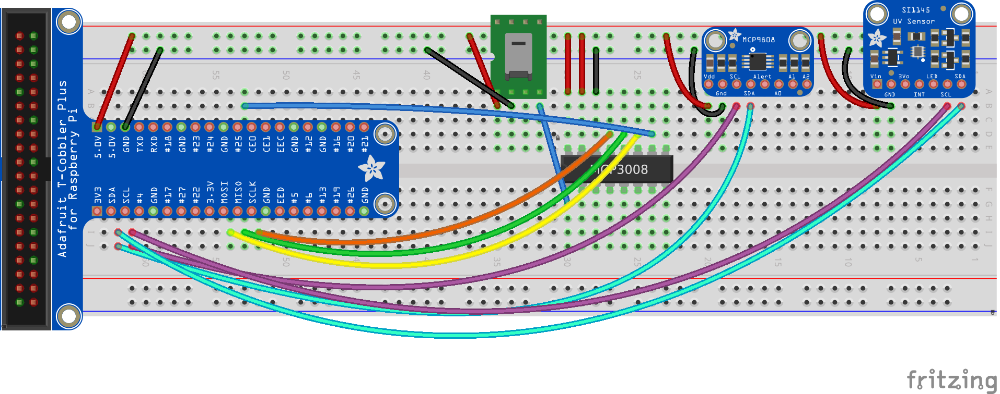
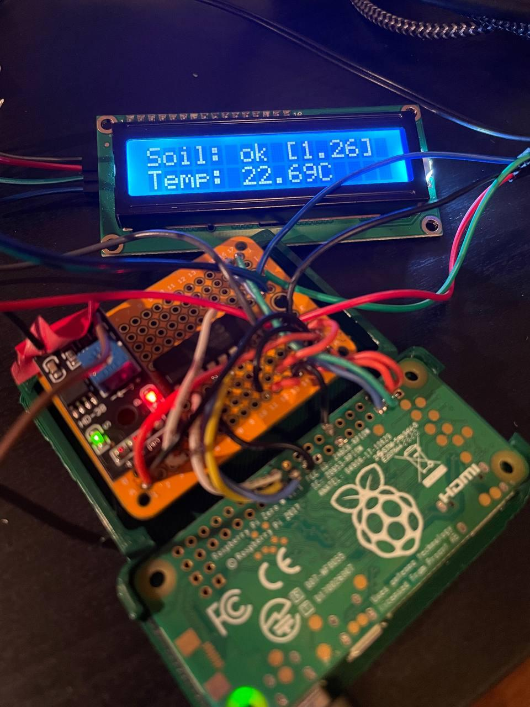

# raspi-gardener

`raspi-gardener` is a simple client-server module that allows a `Raspberry Pi` monitor my vegetable patches, as well as indoor plants.

Contains a **`client`** module, written in `Python`, that talks to `i2c` and `spi` sensors on `Pi`, as well as a **`server`** module, written in `go`, that provides a `RESTful` endpoint, can store data to a database, and send notifications via email.

Written for an article on [my blog](https://chollinger.com/blog). Find [part 1 here](https://chollinger.com/blog/2021/04/raspberry-pi-gardening-monitoring-a-vegetable-garden-using-a-raspberry-pi-part-1) and [part 2 here](https://chollinger.com/blog/2021/07/raspberry-pi-gardening-monitoring-a-vegetable-garden-using-a-raspberry-pi-part-2-3d-printing/).

## Target Circuit

## Layout

### `core/`
- `client/` - Main monitor using `HD-38`, `MCP9808`, `MAX44009` 
- `server/` - Server getting data
- `cad/` - CAD design 

### `examples/`
- `moist/` - Moisture sensor `HD-38` (Aliexpress/Amazon) via `SPI`
- `raw/` - Manual parser/driver for `MCP9808` (Temperature sensor) 
- `temperature/` - Normal parser for `MCP9808` (Temperature sensor)
- `uv/si1145` - Normal parser for `SI1145` (UV, IR, VL sensor)
- `uv/veml6070` - Normal parser for `VEML6070` (UV sensor)

### Custom Stuff
- `client/max44009/` - Custom driver for `MAX4409`

## Install
Please see the [client README.md](client/README.md) and [server README.md](server/README.md)

## Optional
A small LCD:

