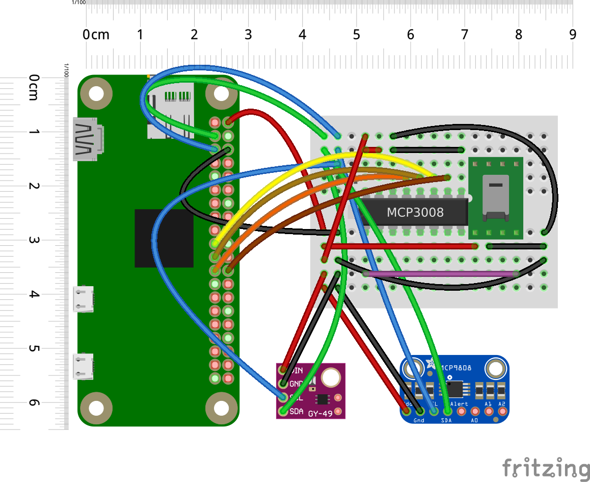

# raspi-gardener

A collection of `Python` scripts to run a Raspberry Pi to monitor my vegetable patches. Sends data to a REST API written in `golang`.

Written for an article on [my blog](https://chollinger.com/blog).

This really is more a collection of scripts than anything useful.

## Target Circuit

## Layout

- `client/` - Main monitor using `HD-38`, `MCP9808`, `SI1145`
- `moist/` - Moisture sensor `HD-38` (Aliexpress/Amazon) via `SPI`
- `raw/` - Manual parser/driver for `MCP9808` (Temperature sensor) 
- `temperature/` - Normal parser for `MCP9808` (Temperature sensor)
- `uv/si1145` - Normal parser for `SI1145` (UV, IR, VL sensor)
- `uv/veml6070` - Normal parser for `VEML6070` (UV sensor)